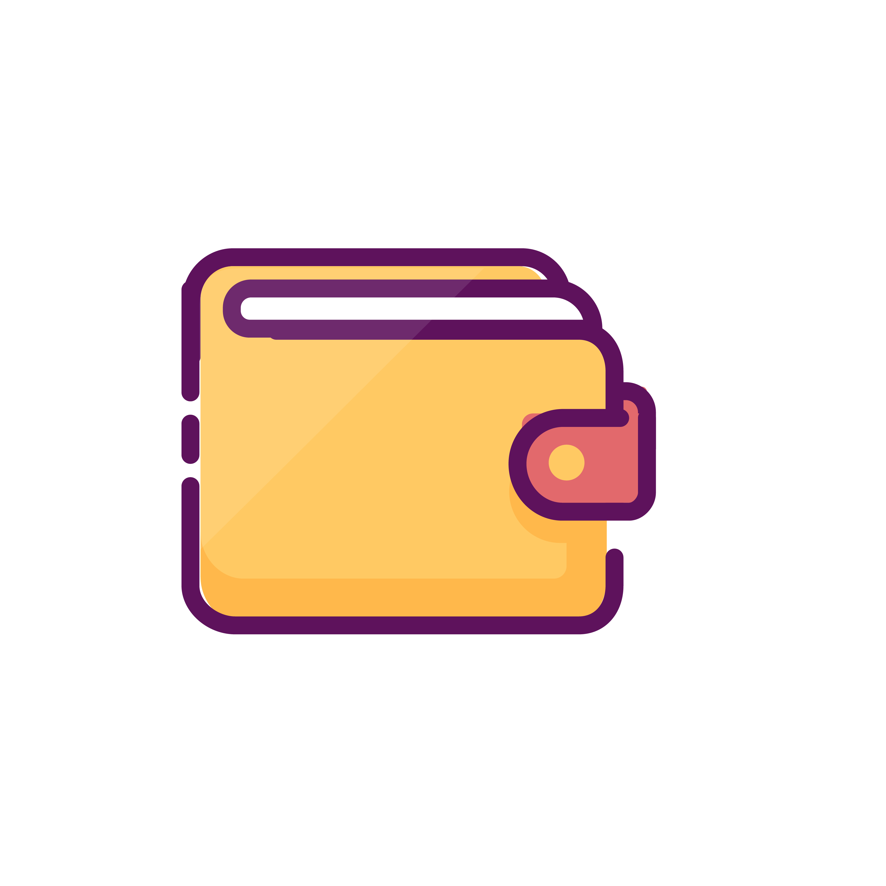
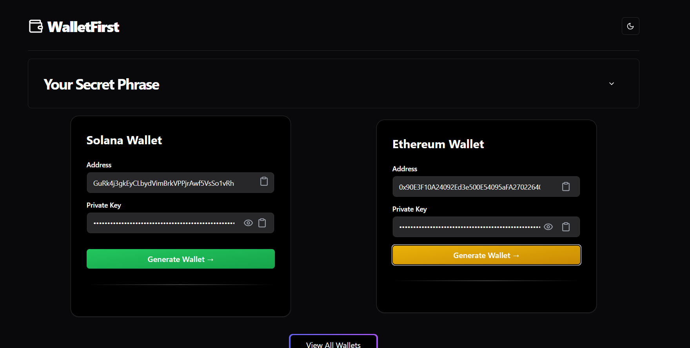

# WalletFirst

## Overview

WalletFirst is a React-based application that simplifies the process of creating cryptocurrency wallets for both Solana and Ethereum networks. The web-app allows users to generate secure wallets using mnemonic phrases and it displays both public and private keys for each generated wallet. The app is designed to be user-friendly, making it easy for both beginners and experienced users to create wallets for their favorite blockchain networks.

 
  

